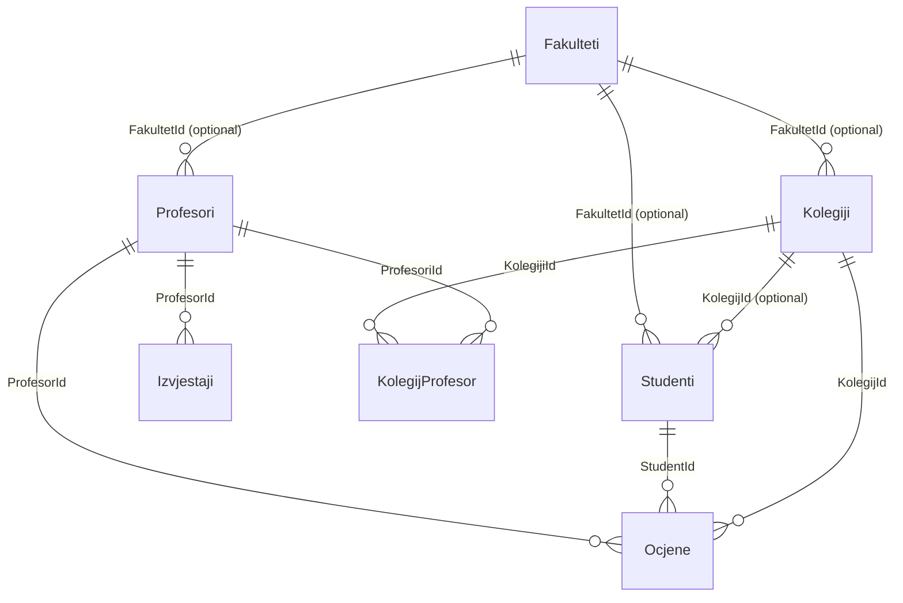

# Database Semantic Model (EF Core)

This document describes the EF Core database schema for this project based on the `InitialCreate` migration.

- DbContext: `Asp_projekt.Data.AppDbContext`
- Provider: SQL Server
- Migration source of truth: `Asp_projekt/Data/Migrations/20260507115052_InitialCreate.cs`

## ER overview (high-level)

- `Fakulteti` is the parent (optional FK) for `Profesori`, `Studenti`, `Kolegiji`.
- `Profesori` and `Kolegiji` are **many-to-many** via join table `KolegijProfesor`.
- `Kolegiji` has a **one-to-many** relationship to `Studenti` via `Studenti.KolegijId` (this FK is created by EF conventions because `Kolegij` has `ICollection<Student> Studenti`).
- `Ocjene` references exactly one `Profesor`, one `Student`, and one `Kolegij` (required FKs, cascade delete).
- `Izvjestaji` references exactly one `Profesor` (required FK, cascade delete).

## Tables

### Table: `Fakulteti`

**Primary key**
- `Id` (int, identity)

**Columns**
- `Id` (int, NOT NULL, identity)
- `Naziv` (nvarchar(max), NOT NULL)

**Relationships**
- 1 → many: `Fakulteti.Id` → `Profesori.FakultetId` (optional)
- 1 → many: `Fakulteti.Id` → `Studenti.FakultetId` (optional)
- 1 → many: `Fakulteti.Id` → `Kolegiji.FakultetId` (optional)

---

### Table: `Kolegiji`

**Primary key**
- `Id` (int, identity)

**Columns**
- `Id` (int, NOT NULL, identity)
- `Naziv` (nvarchar(max), NOT NULL)
- `ECTS` (int, NOT NULL)
- `FakultetId` (int, NULL)

**Foreign keys**
- `FakultetId` → `Fakulteti.Id` (optional)

**Relationships**
- many → 1: `Kolegiji.FakultetId` → `Fakulteti.Id`
- many ↔ many: `Kolegiji` ↔ `Profesori` via `KolegijProfesor`
- 1 → many: `Kolegiji.Id` → `Studenti.KolegijId` (optional)
- 1 → many: `Kolegiji.Id` → `Ocjene.KolegijId` (required, cascade)

---

### Table: `Profesori`

**Primary key**
- `Id` (int, identity)

**Columns**
- `Id` (int, NOT NULL, identity)
- `Ime` (nvarchar(max), NOT NULL)
- `Prezime` (nvarchar(max), NOT NULL)
- `Katedra` (nvarchar(max), NOT NULL)
- `FakultetId` (int, NULL)

**Foreign keys**
- `FakultetId` → `Fakulteti.Id` (optional)

**Relationships**
- many → 1: `Profesori.FakultetId` → `Fakulteti.Id`
- many ↔ many: `Profesori` ↔ `Kolegiji` via `KolegijProfesor`
- 1 → many: `Profesori.Id` → `Ocjene.ProfesorId` (required, cascade)
- 1 → many: `Profesori.Id` → `Izvjestaji.ProfesorId` (required, cascade)

---

### Table: `Studenti`

**Primary key**
- `Id` (int, identity)

**Columns**
- `Id` (int, NOT NULL, identity)
- `Ime` (nvarchar(max), NOT NULL)
- `Prezime` (nvarchar(max), NOT NULL)
- `DatumUpisa` (datetime2, NOT NULL)
- `FakultetId` (int, NULL)
- `KolegijId` (int, NULL)

**Foreign keys**
- `FakultetId` → `Fakulteti.Id` (optional)
- `KolegijId` → `Kolegiji.Id` (optional)

**Relationships**
- many → 1: `Studenti.FakultetId` → `Fakulteti.Id`
- many → 1: `Studenti.KolegijId` → `Kolegiji.Id`
- 1 → many: `Studenti.Id` → `Ocjene.StudentId` (required, cascade)

**Note**
- `KolegijId` is an optional FK and is now explicitly declared on the `Student` model (along with `Student.Kolegij`).

---

### Table: `Ocjene`

**Primary key**
- `Id` (int, identity)

**Columns**
- `Id` (int, NOT NULL, identity)
- `Vrijednost` (int, NOT NULL)
- `Komentar` (nvarchar(max), NOT NULL)
- `DatumOcjene` (datetime2, NOT NULL)
- `Tip` (int, NOT NULL)  
  - Maps to enum `TipOcjene` (`Predavanje`, `Komunikacija`, `Organizacija`, `Materijali`, `UkupniDojam`)
- `ProfesorId` (int, NOT NULL)
- `StudentId` (int, NOT NULL)
- `KolegijId` (int, NOT NULL)

**Foreign keys**
- `ProfesorId` → `Profesori.Id` (required, cascade delete)
- `StudentId` → `Studenti.Id` (required, cascade delete)
- `KolegijId` → `Kolegiji.Id` (required, cascade delete)

---

### Table: `Izvjestaji`

**Primary key**
- `Id` (int, identity)

**Columns**
- `Id` (int, NOT NULL, identity)
- `ProfesorId` (int, NOT NULL)
- `ProsjecnaOcjena` (float, NOT NULL)
- `BrojOcjena` (int, NOT NULL)
- `DatumGeneriranja` (datetime2, NOT NULL)

**Foreign keys**
- `ProfesorId` → `Profesori.Id` (required, cascade delete)

---

### Join table: `KolegijProfesor`

This is an auto-generated join table for the many-to-many relationship between `Kolegij` and `Profesor`.

**Primary key (composite)**
- (`KolegijiId`, `ProfesoriId`)

**Columns**
- `KolegijiId` (int, NOT NULL)
- `ProfesoriId` (int, NOT NULL)

**Foreign keys**
- `KolegijiId` → `Kolegiji.Id` (required, cascade delete)
- `ProfesoriId` → `Profesori.Id` (required, cascade delete)

---

## Non-table models (not mapped)

These exist in `Asp_projekt/Models` but are not part of the EF Core schema in `AppDbContext`:

- `Administrator`
- `ErrorViewModel`
- `HomeDashboardViewModel`
- `MainClass`
- `OcjenaCreateViewModel`

## Runtime behaviors (not schema)

These behaviors do not change the schema, but they affect how data gets into (and out of) the database when running the app:

- On application startup, EF Core migrations are applied via `db.Database.Migrate()`.
- When the database is empty, the app seeds sample data (see `Asp_projekt.Models.MainClass.SeedDatabase`).
- The UI supports deleting individual `Ocjena` records; this removes only the selected row from `Ocjene`.

## Mermaid ER diagram (optional)

